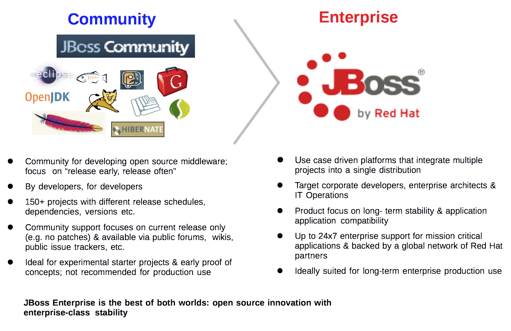

### An Introduction to the Red Hat Model
Jeremy Brown - Head of Middleware UK&I, Red Hat

[@tenfourty] [1]
[1]: http://twitter.com/tenfourty/ "@tenfourty"
<jeremy@redhat.com>

---

## What links all of these technologies?

 <!-- .element: class="noshadow" style="float: right" --> <!-- .element: class="fragment" data-fragment-index="2" -->

* Android
* Facebook
* Amazon WS
* Hadoop
* Linux
* OpenStack

All based on Open Source, the engine of innovation <!-- .element: class="fragment" data-fragment-index="1" -->

---

### Lets talk about some **principles** for selecting software
Lets call them Jeremy's golden rules for buying ;-)

1. Software for your enterprise needs to be proven and ready for production <!-- .element: class="fragment" data-fragment-index="1" -->
2. Everything you run in production should have long term enterprise grade support <!-- .element: class="fragment" data-fragment-index="2" -->
3. Your cost of aquisition for software should be minimal (license plus training etc.) and the ongoing cost should be predicatable <!-- .element: class="fragment" data-fragment-index="3" -->
4. Your TCO calculations should include the Cost of Exit and should be factored in during the selection process <!-- .element: class="fragment" data-fragment-index="4" -->
5. Your exposure to Vendor lock-in should be minimised and you should be able to walk away and keep the bits <!-- .element: class="fragment" data-fragment-index="5" -->
6. You shouldn't pay for upgrades! <!-- .element: class="fragment" data-fragment-index="6" -->

---

### And some bonus rules for Open Source
#### Though you might apply them to proprietary software too <!-- .element: class="fragment" data-fragment-index="1" -->

1. What is the size and adoption of the community behind this solution? Is it still growing? <!-- .element: class="fragment" data-fragment-index="2" -->
2. How open is the community? Does the license allow the community to fork the code?  <!-- .element: class="fragment" data-fragment-index="3" -->

---

## Red Hat's Model: Community Powered Innovation
### Does it meet Jeremy's rules?  <!-- .element: class="fragment" data-fragment-index="1" -->

---

## Many variations vendors take on open source

* Some enable optimizations for their hardware <!-- .element: class="fragment" data-fragment-index="1" -->
* Some use open-core to upsell proprietary add-ons <!-- .element: class="fragment" data-fragment-index="2" -->
* Some invest in focused areas <!-- .element: class="fragment" data-fragment-index="3" -->
* Some contribute little and soley ship and support <!-- .element: class="fragment" data-fragment-index="4" -->

---

## AND SOME...
# GO ALL IN <!-- .element: class="fragment" data-fragment-index="1" -->

---

 <!-- .element: class="noshadow" fullscreen-size="contain" -->

---

### JBoss Community & JBoss Enterprise
#### Targeting Different Users & Use Cases

 <!-- .element: class="noshadow" fullscreen-size="contain" -->

---

 <!-- .element: class="noshadow" fullscreen-size="contain" -->

---

## Is Open Source a Business Model?

* No <!-- .element: class="fragment" data-fragment-index="1" -->
* But it is the best DEVELOPMENT model on the planet <!-- .element: class="fragment" data-fragment-index="2" -->
* Enables collaboration <!-- .element: class="fragment" data-fragment-index="3" -->
* Gives users flexibility to consume on their terms <!-- .element: class="fragment" data-fragment-index="4" -->

---

## What do these have in common?
* Linux
* OpenStack
* Hadoop
* Rails
* MongoDB
* Git
* Cassandra

---

## What do these have in common?
* They are all open source
* They are all examples of next-generation IT solutions
* They were started by users and developers, not companies

---

## Cloud without open source software?
* No Amazon
* No Rackspace
* No Google
* No Yahoo!
* No Salesforce.com
* No LinkedIn
* No Pandora
* No Twitter
* No Facebook

---

## Thank you
This [presentation] [1] is running on [OpenShift] [2],

the source code is on [GitHub] [3]

and it was developed in HTML5 with [reveal.js] [4]

Jeremy Brown [@tenfourty] [5]

[1]: http://pressos-runningonthe.rhcloud.com/theRedHatModel.html
[2]: http://www.openshift.com/ "OpenShift"
[3]: https://github.com/tenfourty/pressos
[4]: https://github.com/hakimel/reveal.js "reveal.js"
[5]: http://twitter.com/tenfourty/ "@tenfourty"
<jeremy@redhat.com>

 <!-- .element: class="noshadow" -->

